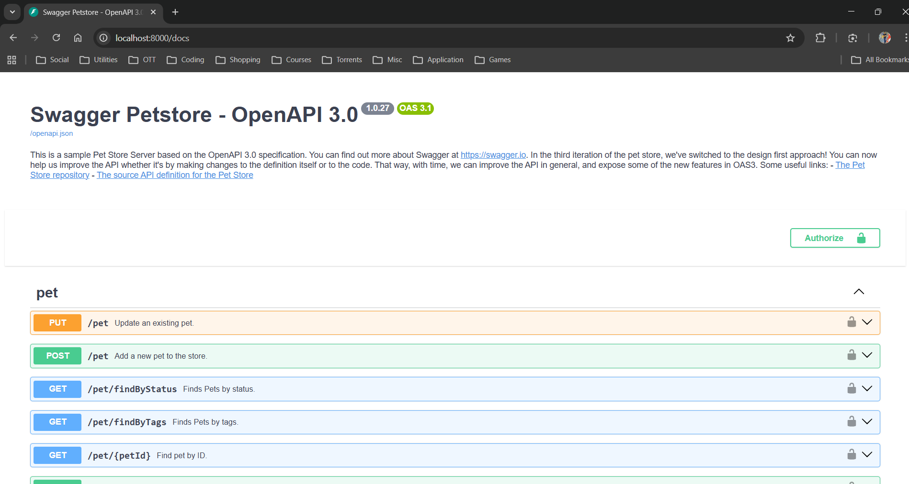

# Cookiecutter OpenAPI FastAPI MongoDB Template


A production-ready cookiecutter template for building high-performance RESTful APIs using **FastAPI**, **MongoDB** (Motor), and **OpenAPI** code generation.

**🌐 [Live Documentation & Website](https://therikb31.github.io/cookiecutter-openapi-fastapi-mongo/)**

This repository serves as an excellent starter template for **Monorepo Microservice Architecture** and is designed to help developers master **Swagger/OpenAPI-led contract-driven API development**.



## Features

- [x] **FastAPI**: Asynchronous, high-performance web framework.
- [x] **MongoDB**: Asynchronous CRUD operations via Motor.
- [x] **OpenAPI Generation**: Automatically generate routes and models from your spec.
- [x] **Containerization**: Docker and `docker-compose` support.
- [x] **Modern Tooling**: Powered by [uv](https://docs.astral.sh/uv/) for 10-100x faster dependency management.
- [x] **Post-hook Installation**: Automatically syncs dependencies after project creation.
- [x] **Website Integration**: Includes a template for a project website.

## Prerequisites

- Python 3.11+
- [uv](https://docs.astral.sh/uv/) (`curl -LsSf https://astral.sh/uv/install.sh | sh`)
- [Cookiecutter](https://github.com/cookiecutter/cookiecutter) (`pip install cookiecutter`)
- Docker & Docker Compose

## Getting Started

### 1. Generate a New Project

Run the following command and follow the prompts:

```bash
cookiecutter https://github.com/therikb31/cookiecutter-openapi-fastapi-mongo
```

### 2. Configure Environment

The project comes with a `.env.example`. After generation, a `.env` file is automatically created. Edit it to match your needs:

```bash
MONGO_USERNAME=root
MONGO_PASSWORD=password
MONGO_DBNAME=fastapi_db
```

### 3. Run with Docker

```bash
docker-compose up --build
```

### 4. Generation Script

To regenerate models from your OpenAPI spec:

```bash
# Windows
./openapi/generate.ps1 -ServiceName <your_service_name>

# Linux/macOS
./openapi/generate.sh <your_service_name>
```

## Project Structure

```text
your-project/
├── libs/              # Shared libraries (MongoDB client, etc.)
├── openapi/           # OpenAPI specs and generation scripts
├── services/          # Microservices
│   └── service_name/  # Service implementation
│       ├── api/       # API route implementations
│       ├── conf/      # Service configuration
│       ├── main.py    # Service entry point
│       └── Dockerfile # Service Docker container
├── .env.example       # Environment variables template
├── docker-compose.yaml # Local development setup
├── Makefile           # Dev/Ops automation commands
├── pyproject.toml     # Project dependencies (uv)
└── start.sh           # Service startup script
```

## Website

The project website is located in the `website/` directory.

```bash
cd website
npm install
npm run deploy
```

## Contributing

Contributions are welcome! Please feel free to submit a Pull Request.

## Acknowledgements

This project is a inspired from the [cookiecutter-fastapi-mongo](https://github.com/klee1611/cookiecutter-fastapi-mongo) template by Kourtney Lee.

## License

This project is licensed under the MIT License - see the [LICENSE](LICENSE) file for details.
